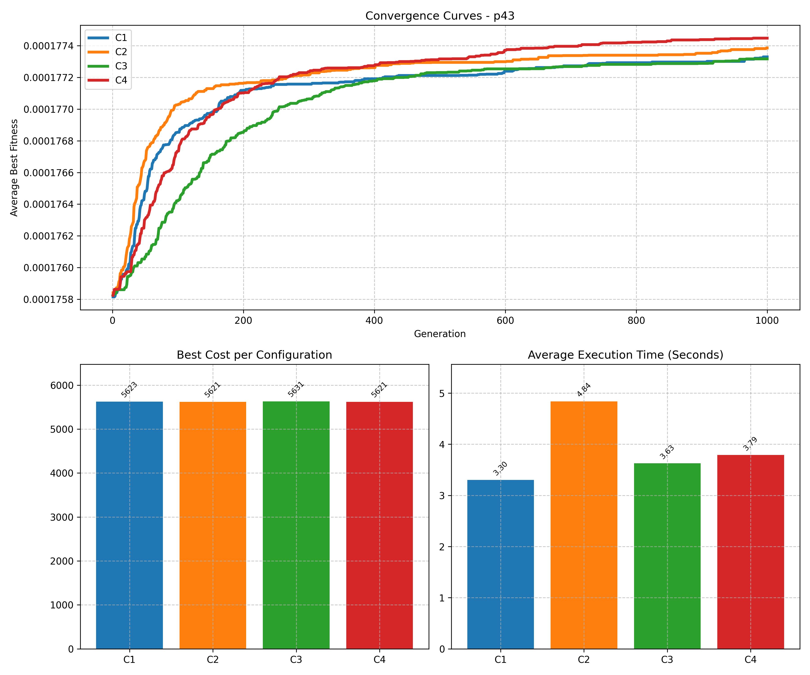

# MATSP

MATSP is an ATSP instance solver based on a Memetic Algorithm (MA) approach.

## Environment Creation

Before executing the application, you must create a Python environment and install the requirements.

```sh
# (First Option) Using the simplified commands provided with Make.
make create-venv
make install-requirements

# (Second Option) Using the standard Python commands.
python3 -m venv venv
source venv/bin/activate
pip install -r requirements.txt
```

## Usage Examples

Running a single configuration file:

```sh
# (First Option) Using the simplified commands provided with Make.
make run CONFIG="resources/configuration.example.yml"

# (Second Option) Using the standard Python commands.
source venv/bin/activate && python3 -u src/main.py --config "resources/configuration.example.yml"
```

Running all configuration files in a directory:

```sh
# (First Option) Using the simplified commands provided with Make.
make run CONFIG="resources/configurations/"

# (Second Option) Using the standard Python commands.
source venv/bin/activate && python3 -u src/main.py --config "resources/configurations/"
```

All YAML configuration files are parsed and executed automatically. A single YAML file may contain multiple configurations.

The output includes:

- a Markdown summary for each configuration;
- an individual convergence plot for each configuration; and
- a combined comparison plot containing:
  - convergence curves (with and without standard deviation);
  - best costs; and
  - average execution times.



The combined comparison plot is generated only when more than one configuration is executed.

## Configuration Naming

When executing multiple configuration files from a directory, file ordering matters.

Avoid naming files like this:

```text
config_1, config_2, ..., config_10, config_11
```

They will be ordered lexicographically:

```text
config_1, config_10, config_11, config_2, ...
```

This happens because filenames are compared character by character.

Instead, use zero-padded numbering, which is the standard convention in scientific computing, datasets, simulation pipelines, rendering systems, logging infrastructures, and backup systems.

```text
config_01, config_02, config_03, ..., config_10, config_11, config_12
```

## Transparency Commitment

Artificial Intelligence (AI) tools were used during the development of this project for the following purposes:

### During development

- evaluating alternative implementations and designs;
- debugging problems with unknown solutions;
- designing the matrix extraction algorithm;
- learning standard solutions and Python practices, such as protocols (PEP 544); and
- designing the YAML configuration expansion system.

### After development

- optimizing some algorithms and implementations; and
- reviewing the project for inconsistencies and typographical errors.

## Disclaimer

MATSP is an educational project.

It is not intended for production environments, nor is it expected to provide state-of-the-art performance for large-scale industrial ATSP instances.

## Credits

- González Tesoro, Joaquín
- Roumec, Iñaki
